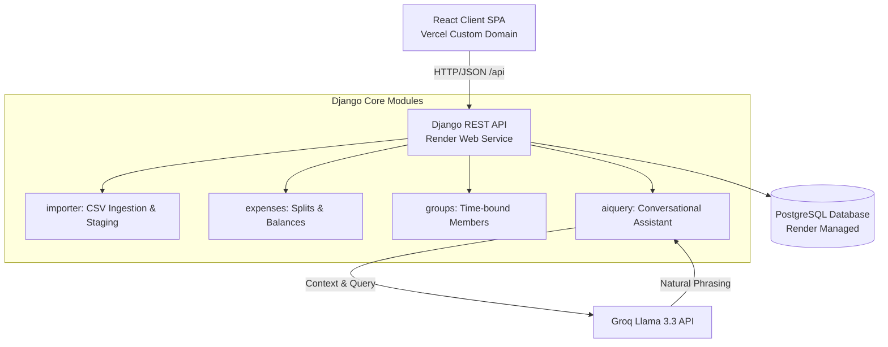

# BrokeTogether — Shared Expenses Engine

[](https://broketogether.komalpreet.me)
[](https://spreetail-expenses-api.onrender.com)
[](https://www.python.org/)
[](https://react.dev/)

BrokeTogether is a production-grade, collaborative group expense tracker and debt settlement engine built for the Spreetail Software Engineering Intern assignment. 

Rather than a simple CRUD application, this system is engineered around handling real-world financial irregularity: validating a deliberately messy CSV log, managing time-bounded group memberships, and providing a deterministic RAG (Retrieval-Augmented Generation) copilot that is mathematically airtight.

* **Live Web App:** [https://broketogether.komalpreet.me](https://broketogether.komalpreet.me)
* **API Endpoint:** [https://spreetail-expenses-api.onrender.com](https://spreetail-expenses-api.onrender.com)
* **Demo Credentials:** Username: `demo` | Password: `BrokeTogether2026!`

---

## Engineering Challenges Solved

### 1. Two-Phase "Stage-Commit" CSV Import
Ingesting user-supplied financial files is notoriously error-prone. BrokeTogether implements a secure import pipeline:
* **Phase 1: Stage & Analyze:** The backend scans the uploaded file against 20+ anomaly detectors (e.g. negative amounts, decimal rounding mismatches, case discrepancies, date formatting errors, and missing payers).
* **Interactive Conflict Resolution UI:** When anomalies are found, the app halts the import. Instead of crashing or guessing, it serves a grid highlighting issues. The user can manually edit, ignore, or override cells directly in their browser.
* **Phase 2: Commit:** Transactions are materialized into the database only after the user resolves and approves all conflicts.

### 2. Time-Bounded Membership Calculations
Flatmates move in and out. Standard Splitwise-like apps apply expenses to all group members, introducing errors for members inactive during the transaction month.
* Built flexible `joined_on` and `left_on` boundaries directly into group memberships.
* The split engine dynamically filters out inactive members on the transaction date (e.g. Sam, who moved in mid-April, is automatically exempted from March electricity splits).
* Powered by a responsive, interactive SVG settlement map detailing transactions with zoom, pan, and dragging controls.

### 3. Airtight AI Copilot ("Brokie")
Includes a conversational AI panel to answer questions like "Who owes Aisha money?" or "What did we spend on groceries?".
* **The Rule:** The LLM never does math.
* **The Solution:** We compute all balances and category statistics deterministically in Python first, then inject these exact facts as JSON context into the Groq Llama 3.3 model context window. This guarantees 100% accurate financial answers while maintaining a friendly, conversational helper.

---

## Technology Stack

| Component | Technology | Description |
| :--- | :--- | :--- |
| **Backend** | **Python 3.13 / Django 5** | Django REST Framework for API endpoints, SimpleJWT for token authentication. |
| **Frontend** | **React 19 / Vite** | Client-side routing, Axios, Tailwind CSS, Radix UI primitives. |
| **Database** | **PostgreSQL (Prod) / SQLite (Local)** | Relational database schema with strict constraints and foreign keys. |
| **AI Engine** | **Groq API / Llama 3.3** | Handles natural-language querying via pre-computed JSON facts. |
| **Hosting** | **Render (Backend) / Vercel (Frontend)** | Zero-downtime static hosting paired with managed database instances. |

---

## Architecture & Data Flow




## Deliverables & Walkthrough Map

For the live technical review, these files detail specific logic implementation:

| File | Type | Purpose / Code Reference |
| :--- | :--- | :--- |
| **[SCOPE.md](./SCOPE.md)** | Document | Details all 20+ CSV anomalies, matching resolution policies, and the database schema. |
| **[DECISIONS.md](./DECISIONS.md)** | Document | Architectural decision log (greedy settle-up, simple JWT, currency models, and design trade-offs). |
| **[AI_USAGE.md](./AI_USAGE.md)** | Document | Details AI pair-programming assistant usage, key prompts, and 4 bugs caught and resolved. |
| **[walkthrough.md](./walkthrough.md)** | Document | UI layouts, responsive floating widgets, and SVG design documentation. |
| **[money.py](./backend/expenses/money.py)** | Code | Fixed-point integer calculations preventing floats rounding errors. |
| **[splitting.py](./backend/expenses/splitting.py)** | Code | Mathematical rules for equal, unequal, ratio, and percentage splitting. |
| **[parsing.py](./backend/importer/parsing.py)** | Code | Core anomaly scanning and CSV parser rules. |
| **[balances.py](./backend/expenses/balances.py)** | Code | Deterministic net balance aggregator and greedy simplify-debt engine. |
| **[services.py](./backend/aiquery/services.py)** | Code | Facts building and Groq Llama context-injection services. |

---

## Local Setup & Execution

### 1. Run the Backend API
```bash
cd backend
python -m venv .venv
.venv\Scripts\activate            # Windows
# source .venv/bin/activate       # macOS / Linux

pip install -r requirements.txt
copy .env.example .env            # Add your optional GROQ_API_KEY for the chatbot
python manage.py migrate
python manage.py bootstrap_demo   # Automatically seeds Flat 4B and imports the CSV once
python manage.py runserver        # Runs at http://127.0.0.1:8000
```

* **Run Backend Unit Tests:** `python manage.py test` (13 tests verifying split logic and dates).
* **CLI CSV Import Utility:** `python manage.py import_csv --commit` (stages/commits CSV from console).

### 2. Run the Frontend Client
```bash
cd frontend
npm install
npm run dev                       # Runs at http://localhost:5173
```
*Login using the demo user credentials: `demo` / `BrokeTogether2026!`.*

---

## Production Deployment
* **Backend (Render):** Automatically deploys via the blueprint configuration in [render.yaml](./render.yaml). Provisions a managed PostgreSQL instance and runs the idempotent `bootstrap_demo` command on start.
* **Frontend (Vercel):** Deploys React client from the `frontend/` directory. CORS policy configured to allow production domains (`*.vercel.app` and `*.komalpreet.me`).
