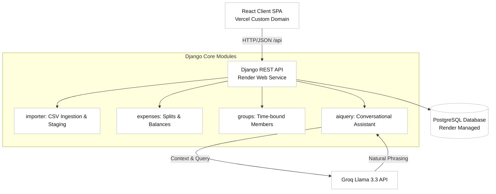
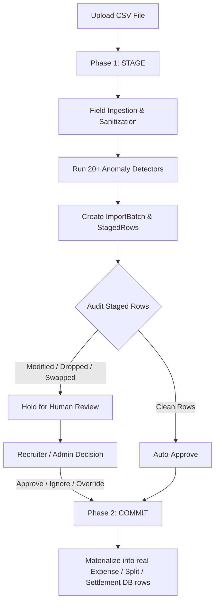
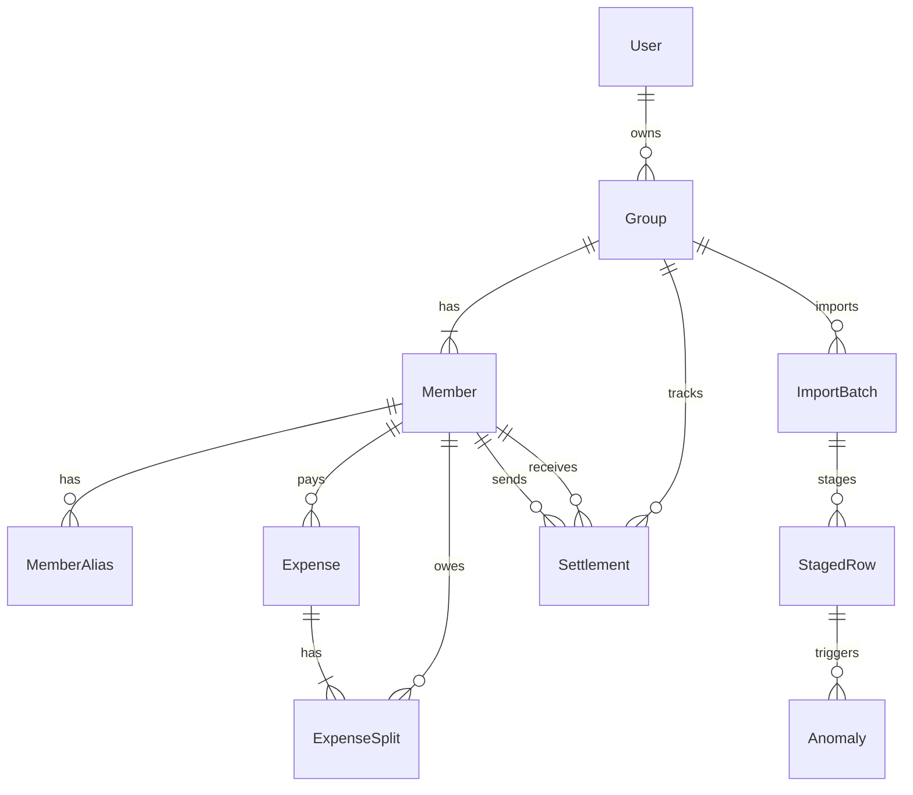

# BrokeTogether — Shared Expenses App

A Splitwise-style shared-expenses app for a flatmate group, built for the
Spreetail Software Engineering Intern assignment. The hard part — and the focus
of this project — is **ingesting a deliberately messy CSV**: detecting every data
problem, surfacing it, and handling it deliberately instead of silently.

- **Live app:** https://broketogether.komalpreet.me
- **Fallback URL:** https://spreetail-shared-expenses-omega.vercel.app
- **API:** https://spreetail-expenses-api.onrender.com
- **Demo login:** `demo` / `BrokeTogether2026!`

> Note: the API runs on Render's free tier and **cold-starts (~50s) after
> inactivity** — the first request after a quiet period is slow, then it's fast.

> Built with an AI pair-programmer (Claude / Claude Code) directing it as the
> engineer of record. See [AI_USAGE.md](./AI_USAGE.md), including four concrete
> cases where the AI was wrong and how they were caught.

## What it does

- **Login** (JWT auth with secure, warning-free credentials).
- **Groups** with **time-bounded membership** — members join and leave, and an
  expense only affects who was a member on its date.
- **Group Creation Modal**: Replaced unstyled browser `prompt()` popups with a beautiful, custom Radix `<Dialog>` modal.
- **Expenses** in four split types: equal, unequal (exact amounts), percentage,
  and share (ratio).
- **Balances**: net balance per person, a minimal **settle-up** plan ("who pays
  whom"), and a **drill-down** showing exactly which expenses make up a number.
- **Direct Settlements**: Record settlements directly on the Overview page with a "Settle" trigger and an interactive "Recent Settlements" logger.
- **CSV import** with full anomaly detection, a **review/approve** workflow, and
  a generated **import report**.
- **Brokie AI (Floating Assistant)**: A global, compact floating AI copilot widget designed with rounded corners, custom light/dark grey mode settings, and reduced typography.
- **Conversational RAG Upgrades**: Brokie has access to the 15 most recent expenses and category spending summaries, allowing users to ask questions like *"Who paid for the last flight?"* or *"What did we spend on food?"*.

## Documents (assignment deliverables)

| File | What |
|------|------|
| [SCOPE.md](./SCOPE.md) | Every CSV anomaly + how it's handled, and the DB schema |
| [DECISIONS.md](./DECISIONS.md) | Decision log: options considered and why |
| [IMPORT_REPORT.md](./IMPORT_REPORT.md) | Machine-generated import report (24 anomalies) |
| [AI_USAGE.md](./AI_USAGE.md) | AI tools, key prompts, and 4 things the AI got wrong |
| [walkthrough.md](./walkthrough.md) | Detailed documentation of UI layouts, responsive floating widgets, and AI features |

## Tech stack

- **Backend:** Python 3.13, Django 5 + Django REST Framework, SimpleJWT.
- **Database:** PostgreSQL in production, SQLite locally (`dj-database-url`).
- **Frontend:** React 19 + Vite, React Router, Axios, Radix UI.
- **AI:** Groq `llama-3.3-70b-versatile` (free tier) for the NL query only.
- **Deploy:** Render (API + Postgres) + Vercel (React) with custom domain support.

## Architecture & Data Flow



## Two-Phase CSV Import Lifecycle



## Database Schema (ERD)



## Run locally

### Backend
```bash
cd backend
python -m venv .venv
.venv\Scripts\activate            # Windows  (use: source .venv/bin/activate on macOS/Linux)
pip install -r requirements.txt
copy .env.example .env            # then add your GROQ_API_KEY (optional)
python manage.py migrate
python manage.py bootstrap_demo   # seeds the group + imports the CSV once
python manage.py runserver        # http://127.0.0.1:8000
```

Useful commands:
```bash
python manage.py test             # run the test suite (13 tests)
python manage.py import_csv       # stage the CSV and (re)generate IMPORT_REPORT.md
python manage.py import_csv --commit
```

### Frontend
```bash
cd frontend
npm install
# .env already points at http://127.0.0.1:8000/api for local dev
npm run dev                       # http://localhost:5173
```

Log in with `demo` / `BrokeTogether2026!`.

## Deploy

**Backend (Render):** New → Blueprint → connect this repo. `render.yaml`
provisions the web service + free Postgres, runs migrations and the idempotent
`bootstrap_demo` (which unconditionally syncs the demo user credentials). After it provisions, set the `GROQ_API_KEY` env var.

**Frontend (Vercel):** New Project → import this repo → **Root Directory =
`frontend`** (Vite auto-detected). Add env var `VITE_API_URL =
https://<your-render-host>/api`. Deploy.

CORS already allows `*.vercel.app` as well as the custom domains `broketogther.komalpreet.me` and `broketogether.komalpreet.me`.

## API overview

```
POST /api/auth/register | login | refresh        GET /api/auth/me
GET/POST/DELETE /api/groups/ | /members/ | /expenses/ | /settlements/
GET  /api/groups/<id>/balances
GET  /api/groups/<id>/members/<mid>/breakdown
POST /api/imports/upload   GET /api/imports/<id>   POST /api/imports/<id>/commit
POST /api/imports/<id>/rows/<rid>/decision
POST /api/groups/<id>/ask
```

## Where to look (for the live walkthrough)

- Money & rounding: [`backend/expenses/money.py`](./backend/expenses/money.py)
- Split math: [`backend/expenses/splitting.py`](./backend/expenses/splitting.py)
- Anomaly detection: [`backend/importer/parsing.py`](./backend/importer/parsing.py)
  + [`backend/importer/services.py`](./backend/importer/services.py)
- Balance calculation: [`backend/expenses/balances.py`](./backend/expenses/balances.py)
- AI (phrasing & context expansion): [`backend/aiquery/services.py`](./backend/aiquery/services.py)
